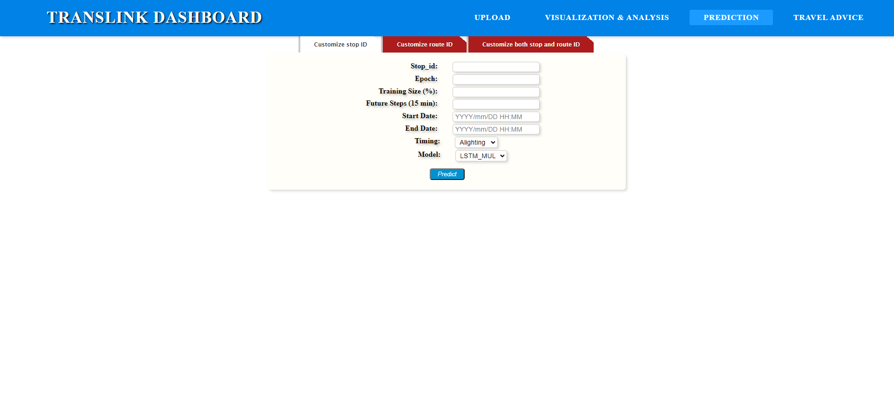

## Introduction

This project is a web-based application for traffic flow prediction and visualization purposes. It is based on Python Flask web framework and uses multiple deep learning models including multi-variate LSTM. The technique stack applied is listed as follows:

- Python 
- Flask (Python)
- Numpy
- Pandas
- Matplotlib
- Pytorch
- Deep learning algorithm (RNN, LSTM)
- MVC
- HTML/CSS/JavaScript
- Data preprocessing
- Data cleaning

The project technically consists of two components for its functionalities. The application could visualize passenger flow through the dataset, and it could also predict and visualize future passenger flow based on deep learning algorithm.

## Traffic Flow Visualization

Traffic flow pattern is diverse if different constraints are applied. As shown in the panel, the traffic flow could be visualized by different granularities in terms of time intervals. Users could set different constraints on traffic flow including:

- Start date
- End date
- Timing
- ID
- Time Interval

The constraints applied provides a deep insight into passenger flow and traffic condition for analysis purposes. Traffic flow could be customized by a certain route or a bus stop:

Users could view passenger flow using heat map:

## Traffic Flow Prediction

The application supports deep learning models for traffic flow prediction. The constraints includes:

- ID
- Epoch
- Training size
- Future steps
- Start date
- End date
- Timing
- Model

## Dataset

The dataset used in the project is collected and published by TransLink, which is a public transit agency for Queensland Australia. The dataset is available at https://drive.google.com/file/d/1O-ossZ8x4m2r-rJEV60Fe8VkMGVCCAJy/view?usp=sharing

