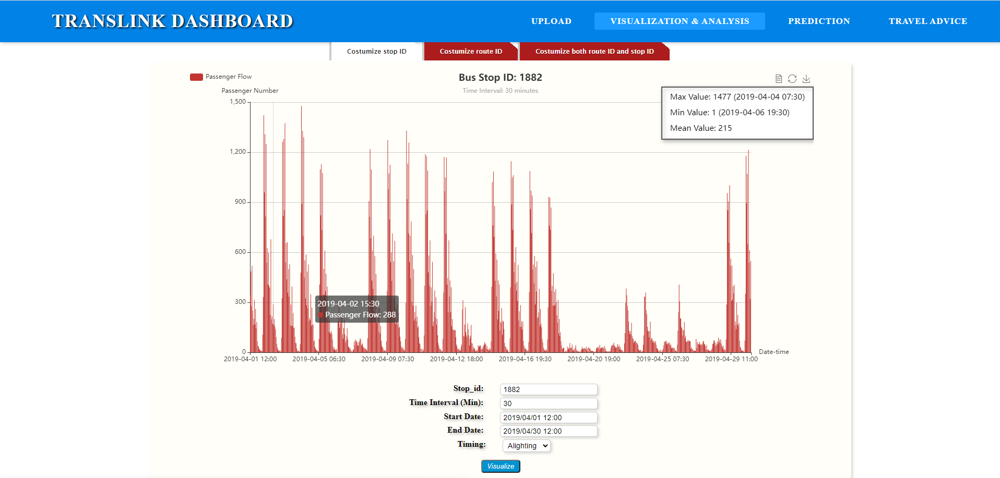
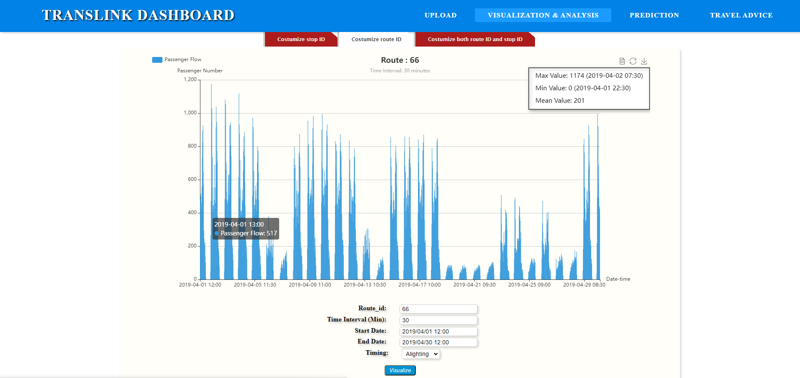
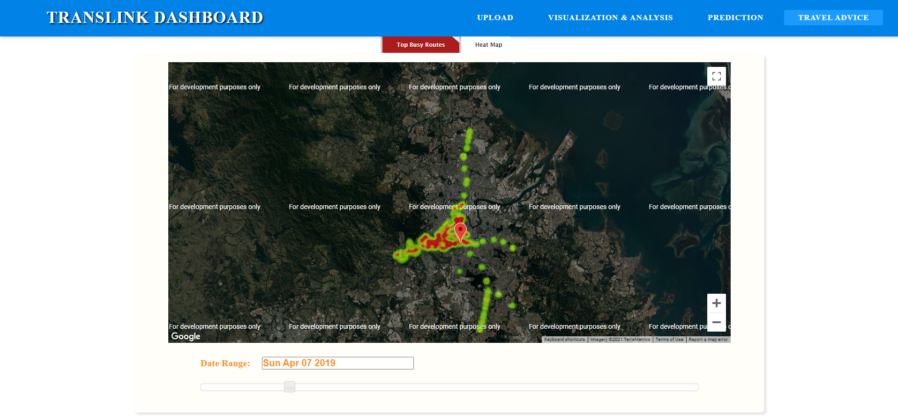

## Introduction

This project is a web-based application for research purposes to analyze Queensland traffic condition in Australia. It is based on Python Flask web framework and deploys multiple deep learning models including multi-variate LSTM.

The project delivers two major functionalities, including traffic flow visualization and prediction. The dataset utilized in the project is published by Queensland public transport agency TransLink (https://translink.com.au/).

The technique stack is listed as follows:

- Python 
- Flask (Python)
- MVC
- HTML/CSS/JavaScript
- Numpy
- Pandas
- Matplotlib
- Pytorch
- Deep Learning Algorithm (RNN, LSTM)
- Data Preprocessing
- Data Cleaning

## Traffic Flow Visualization

In traffic flow analysis, traffic flow pattern is diverse due to customized constraints. As shown in the screenshot, the traffic flow could be visualized by different granularities considering time intervals. Other elements of constraints on traffic flow are listed as follows:

- ID
- Start Date
- End Date
- Timing

The statistics panel is placed at the top-right corner, featured by maximum, minimum, and mean value. The passenger flow could be visualized in different modes, customized by a stop, a route, or combined.

In travel advice panel, a heat map is deployed to visualize density and spatial distribution of passenger flow. The red zone in the map represents high density of the traffic flow. Users can slide the bar to select a specific date for visualization.

Top busy route panel is to display the busiest routes throughout a certain period, and it is an early prototype for future application that provides information for travelers.

## Traffic Flow Prediction

The application has implemented cutting-edge deep learning models for time series prediction used in passenger flow. These models consist of Multi-variate LSTM, LSTM, RNN, and GRU. The mechanism in the models is sliding window method, which predicts current time step based on previous ones. 

Similar to visualization function, the predicted passenger flow can be customized by various constraints, which includes

- ID
- Epoch
- Training Size
- Future Steps
- Start Date
- End Date
- Timing
- Model

Prediction function can display future passenger flow step by step based on input parameters of Future Step.

In the panel of Prediction Result, real passenger flow in red and predicted passenger flow in blue are presented separately. On the right side of the green dot line, it is predicted result based on training process on the left side of the green dot line. The prediction result could be measured by two baselines, including RMSE and MAPE.

## Configuration

- Please install and configure Python Flask before using this application
- configuration.text contains all information about the version of each used library.
- It is recommended to use PyCharm editor to run this application on local server, and please set 'Script' folder as source root.
- app.py is the main entrance of the application, so run it to get access to Upload Page.
- Please configure working directory as relative path 'Script\data\Translink_UQ'

